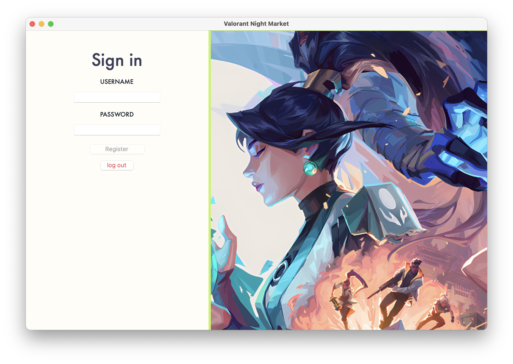

# Time-Limited Night Market Challenge

## 🎮 Game Overview

The **Valorant Night Market Simulator** is a fast-paced resource management game inspired by the in-game marketplace experience. Players start with a balance of 10,000 VP and must maximize their skin purchases within a limited time. Additional VP can be added with a time penalty. The objective is to strategically spend VP, collect skins, and achieve the highest score before time runs out.

## 📦 Features

* **Dynamic Skin Offers:** New sets of skins are presented at varying discounts each session.
* **Balance Management:** Spend VP strategically to acquire the best deals.
* **Data Analysis & Visualization:** Track spending, purchases, and scores with detailed graphs.
* **Leaderboard System:** Compare your performance against other players.

## 🛠️ How to Play

1. Register or log in to start a session.
2. Review available skins and their discounted prices.
3. Purchase skins or add VP (with a time penalty) to continue buying.
4. Check your score and leaderboard standing once the session ends.

## 🔥 Key Metrics Tracked

* Total VP Spent
* Total Skins Acquired
* Score
* Additional VP Added
* Player Scores Graph

---

## Game Mechanics & Functionality

* Players start with a set balance and have limited time to make purchasing decisions.
* Each session features six randomized skins with discounts ranging from 10% to 50%.
* Scoring is based on spending efficiency, number of skins purchased, and the total value of acquisitions.
* Once time expires, the game summary and final score are displayed.

## Project Review

The classic *Tetris* game focuses on spatial arrangement, increasing difficulty, and score tracking. The *Valorant Night Market Simulator* introduces a new twist by combining time-limited purchasing with resource management.

* Both games involve quick decision-making and strategy.
* This game incorporates randomized discounts and skins, ensuring each playthrough is unique.
* Data tracking and visualization add layers of depth, enabling performance analysis over multiple sessions.

## Programming Development

### 3.1 Game Concept

The *Valorant Night Market Challenge* is a high-paced purchasing game with a strategic focus. Players aim to maximize purchases and scoring efficiency within a limited time frame.

**Key Features:**

* **Timer-Based Gameplay:** Players must act quickly before the timer runs out.
* **Randomized Discounts:** Each session presents different skins and deals.
* **Scoring System:** Points are awarded for strategic purchases and spending efficiency.
* **Game Summary Screen:** Displays final score and key metrics at the end of each session.

**Bonus Features:**

* Leaderboard for high scores.
* Combo system: Bonus points for rapid consecutive purchases.

### 3.2 Object-Oriented Programming Implementation

1. **Player:** Manages player balance, inventory, and scoring.

   * Attributes: `balance`, `inventory`, `total_spent`
   * Methods: `purchase_skin()`, `add_money()`, `calculate_score()`

2. **Market:** Generates and manages skin offers and discounts.

   * Attributes: `available_skins`, `discounts`
   * Methods: `generate_offers()`, `apply_discount()`

3. **Skin:** Represents a skin with pricing and rarity.

   * Attributes: `name`, `base_price`, `discounted_price`, `rarity`
   * Methods: `calculate_discount_price()`

4. **GameManager:** Manages game flow, timer, and end-game logic.

   * Attributes: `time_left`, `player`, `market`
   * Methods: `start_game()`, `update_timer()`, `end_game()`

5. **StatsManager:** Collects and analyzes game data.

   * Attributes: `purchase_history`, `highest_score`
   * Methods: `save_data()`, `load_data()`, `analyze_stats()`

### 3.3 Algorithms Involved

* **Randomization Algorithm:** Generates six random skins with varying discounts each session.
* **Countdown Timer:** Implements time-based game logic.
* **Scoring Algorithm:** Calculates player score based on purchases, remaining balance, and spending efficiency.

## Statistical Data (Prop Stats)

### 4.1 Data Features

* **Total Money Spent:** Analyzes spending behavior and strategy.
* **Number of Skins Purchased:** Tracks the number of acquisitions per session.
* **Highest Value Skin:** Identifies the most valuable skin bought in a session.
* **Purchase Speed:** Measures time taken between purchases to assess player decision-making speed.
* **Game Duration:** Tracks how long the player remains active in each session.

### 4.2 Data Recording Method

Data will be stored in a CSV file (`purchase.csv`) and (`leaderboard.csv`).

* Each row represents a game session, recording key metrics such as total money spent, skins purchased, and final score.

### 4.3 Data Analysis & Visualization

Data will be analyzed using basic statistical measures (mean, median, standard deviation) and visualized through:

* Bar Graphs: Compare average VP spent per session.

| **Metric**             | **Purpose**                  | **Data Source**   | **Statistical Measures** |
| ---------------------- | ---------------------------- | ----------------- | ------------------------ |
| Total VP Spent         | Track spending habits        | Player class      | Mean, Median, Std. Dev.  |
| Number of Skins Bought | Analyze purchasing behavior  | Player class      | -                        |
| Highest Value Skin     | Identify valuable purchases  | Market class      | -                        |
| Purchase Speed         | Assess decision-making speed | GameManager class | -                        |
| Game Duration          | Analyze session lengths      | GameManager class | -                        |
| Total Score            | Measure overall performance  | Player class      | Mean, Median, Max        |
| Purchases per Minute   | Track purchasing frequency   | StatsManager      | -                        |