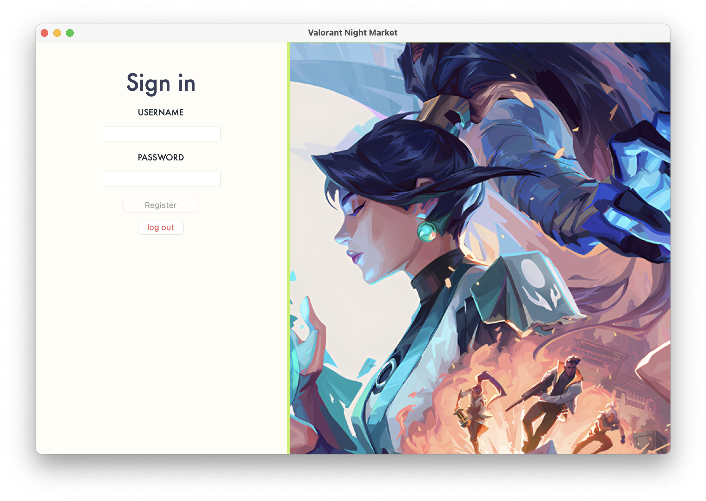

# Valorant Night Market 

This is a **Valorant Night Market Simulator** project, allowing players to simulate the experience of buying skins from the Valorant Night Market. The simulator is designed using **Python** with a graphical user interface (GUI) created using **Tkinter**.


## Features

- **Random Skin Offers**: Each time the Night Market is opened, a selection of random skins is displayed with varying rarities and prices.
- **Skin Purchasing**: Players can purchase skins from the market if they have enough balance. The balance decreases with each purchase.
- **Inventory System**: Players' purchased skins are added to their inventory, allowing them to track their collection.
- **Player Stats**: Track total spent, number of purchases, and calculate a player score based on purchases and spending.
- **Discounted Prices**: Each skin offers a discounted price, making it possible for players to purchase skins at a reduced cost.
- **Timer System**: A timer counts down the time remaining for purchasing skins in the market.
- **Data Logging**: Game data, including transactions, is saved in a CSV file for future analysis.
  
## Requirements

- Python 3.x
- Tkinter (Usually comes pre-installed with Python)
- CSV file containing skin data (`valorant-skins.csv`)

## Installation

1. Clone or download the repository to your local machine.
2. Install Python 3.x from [python.org](https://www.python.org/) if you don't have it already.
3. Ensure that the `valorant-skins.csv` file is in the same directory as the script, or update the path in the code to point to the correct file location.
4. Run the following command to ensure all dependencies are available:
   ```bash
   pip install -r requirements.txt
## Usage
1. Run the `gui.py` script to start the game

2. The graphical interface will open, showing the available skins for purchase.

3. layers can view their balance, inventory, and purchase skins from the market.

4. The player’s score will be updated based on their total purchases and money spent.

